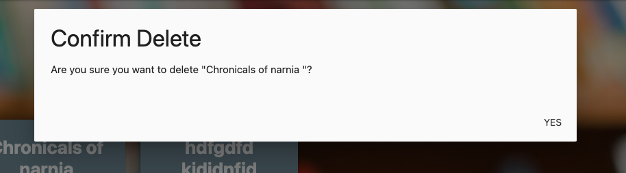

# BookWish
[View website here]()

## Table of Content

1. [Project Goals](#project-goals)
    1. [User Goals](#user-goals)
    2. [Site Owner Goals](#site-owner-goals)
2. [User Experience](#user-experience)
    1. [Target Audience](#target-audience)
    2. [User Requirements and Expectations](#user-requirements-and-expectations)
    3. [User Stories](#user-stories)
3. [Design Choices](#design-choices)
    1. [Images](#images)
    2. [Colour](#colours)
    3. [Structure](#structure)
    4. [Wireframes](#wireframes)
    5. [Database schema & User Journey](#database-schema--user-journey)
4. [Features](#features)
5. [Technologies Used](#technologies-used)
    1. [Languages](#languages)
    2. [Frameworks & Tools](#frameworks--tools)
    3. [Databases & User Journey](#databases--user-journey)
6. [Testing](#testing)
7. [Deployment](#deployment)
8. [Credits](#credits) 
    1. [Media](#media)
    2. [Code](#code)

# Project Goals 
The concept for the BookWish website stemmed from observing the needs of my book-loving family and friends. As avid readers, they constantly seek out new books, discovering titles they're drawn to but often face challenges in obtaining or reading them. Additionally, they struggle to keep track of their growing list of desired reads. I've witnessed friends excitedly stumble upon a book they fancy, only to forget about it later due to lack of a tracking system. Recognizing this common dilemma among readers, I envisioned BookWish as a solution, empowering users to effortlessly compile and manage their book wishlist in one convenient platform.

## User Goals 
* Seamlessly create and manage a personalized wishlist of books they want to read or buy.

## Site Owner Goals 
* Provide an intuitive and enjoyable platform for users to curate their book wishlist.
* Ensure the website is interactive, responsive, and accessible across various devices.

# User Experience 
## Target Audience 
BookWish caters to avid readers and book enthusiasts who seek a centralized platform to organize their reading preferences and track desired books.

## User Requirements and Expectations 
* A simple, intuitive navigation system.
* Smooth functionality of links and buttons.
* Accessibility 

## User Stories 
1.  **Understanding the Site:** As a user, I want to understand the purpose of the site and navigate it easily.
2.  **Registration:** As a user, I want to register for an account.
3.  **Login:** As a user, I want to log into my account.
4.  **Adding Books:** As a user, I want to easily add books to my wishlist.
5.  **Editing Books:** As a user, I want to be able to edit the details of books I have added to my wishlist.
6.  **Deleting Books:** As a user, I want to have the option to remove books from my wishlist.

# Design Choices 

## Colour 
The color scheme for this project was carefully chosen to harmonize with the background imagery of books, creating a visually cohesive and engaging user experience.
#### Color Choices
- **Orange Accent-3**: The vibrant "orange accent-3" from the Materialize color palette was selected to infuse energy and warmth into the design. This bold color choice evokes feelings of enthusiasm and creativity, adding dynamism to key elements of the interface.
  
- **Blue-Grey Lighten-1**: Complementing the vibrant orange accent, the "blue-grey lighten-1" color offers a balanced and calming backdrop. This neutral hue provides visual harmony while ensuring readability and professionalism.
  
- **White Text**: To ensure optimal readability and clarity, white text was chosen against the colored backgrounds. This choice creates a high contrast, enhancing legibility and accessibility for users. Additionally, white text conveys a sense of cleanliness and modernity, aligning with contemporary design principles.

- **Harmonious Palette**: By integrating the orange accent, blue-grey background, and white text, a harmonious color palette was achieved. This cohesive combination reflects the ambiance and theme of the project, enhancing overall visual appeal and coherence.

- **Brand Identity**: Consistent use of colors throughout the project establishes a recognizable brand identity. The cohesive color scheme fosters brand association and strengthens user engagement, contributing to a memorable user experience.

- **User Experience**: The vibrant orange accent guides users' attention to important elements, while the calming blue-grey background promotes a relaxed browsing experience. These color choices enhance user engagement and facilitate intuitive navigation.

## Images 
The background imagery of books was carefully selected to resonate with the website's purpose and theme. Books symbolize knowledge, exploration, and personal growth, aligning perfectly with the concept of a book wishlist platform. The use of imagery not only enhances visual appeal but also reinforces the website's identity and mission. The image used is credited in the credits section at the bottom of this file.
## Structure 
The website is structured in a user-friendly accessible way. The webiste consists of 4 pages:
1. Homepage:
- The user is greeted straight away with a welcome message and the purpose of the website is explained and a link to register for an account or sign in if you already have an account. 
2. Register page:
- The user is shown a form that will need to be completed if they want an account. 
- Once they have registered, they will be redirected to the sign in page. 
3. Sign in page:
- Again a form is displayed where users can enter their account details to sign in.
- Once they have signed in they have access to their own book wishlist.
4. Wishlist page:
- This is the main page of the webiste where users can add, edit and delete books to their wishlist. Only users logged in can access this if not theyre redirected to the log in page with a message saying you need to be logged in to view the wishlist.

## Wireframes 
* [Home page](documentation/wireframes/welcomepage.png)
* [Sign Up page](documentation/wireframes/signuppage.png)
* [Sign In page](documentation/wireframes/signin.png)
* [Wishlist page](documentation/wireframes/wishlistpage.png)

## Database Schema & User journey 

#### User journey 

#### Database Schema

# Features 
This website consists of 6 pages which are extended from a base template.
- Welcome page 
- Sign Up page 
- Login Page
- Wishlist Page
- Add Book page 
- Edit Book page 

### Home page
- Welcomes the user and explains the purpose of the site and has links to sign up or log in. 

Screenshots

 

### Sign Up Form
- Users can register for an account their information will be stored and will be redirected to the sign in page. A message will appear if the username already exists. 

Screenshots

 

### Log In Form
- The details users input will be checked against the database and if the details are correct users are signd into their account where they have access to their personal book wishlist. Once signed in too the navbar has another link where a user can log out of their account.

Screenshots

 

### Wishlist 
- If a user presses the wishlist in the navbar without signing in they are redirected to the log in page and shown a message saying you need to log into your account to see your wishlist. Once a user is signed in, they can add books to their wishlist, as well as edit and delete them. The wishlist items are personalized to each user, ensuring that only they can see and modify their own wishlist.

Screenshots

 

### Add Book 
- Users can add a book to their wishlist by clicking on the "Add Book" button, which redirects them to the add book page. Here, they fill out a form with details such as book title, author, etc. Once submitted, the book is added to their wishlist.

Screenshots

 

### Edit Book
- If a user needs to make changes to a book's details, they can click on the "Edit" button. This action redirects them to the edit book page, where they can modify any section of the book's information and save the updated version.

Screenshots

 

### Delete Book
- To remove a book from their wishlist, users can click on the "Delete" button. This action triggers a modal confirmation prompt to ensure the user intends to delete the book. Upon confirmation, the book is permanently removed from their wishlist.

Screenshots

 

### Responsive Design:
The quiz is designed to be fully responsive, ensuring an optimal experience across various devices and screen sizes.

# Technologies Used
## Languages  
- HTML.
- CSS.
- JavaScript.
- Python 
## Frameworks & Tools
- [Figma](https://www.figma.com/): Utilized for creating wireframes, providing a visual representation of the website's layout and design.
- [Google Fonts](https://fonts.google.com/): Integrated to enhance the typography, offering a diverse range of fonts to elevate the visual aesthetics of the content.
- [GitHub](https://github.com/): Employed as a version control system and a collaborative platform for storing and managing the project's source code
- [Git](https://git-scm.com/): Utilized for version control, allowing seamless collaboration, tracking changes, and ensuring a well-documented development process. Commits and pushes to GitHub provide a clear history of project evolution.
- [Pixelied](https://pixelied.com/convert/png-converter/png-to-webp): Convert png image to webp.
- [TinyPNG](https://tinypng.com/): Compress webp image.
- Materialize: 

# Testing
Testing for this website can be found in the [TESTING.md](TESTING.md)

# Deployment
The BookWish website is deployed on Heroku with elephantsql. 

## Local Deployment
You can fork the World flags Quiz repositry by following these steps:

1. Log in or signup to Github.
2. Find the repository for this website.
3. Click the fork button in the top right corner.

You can clone the repository by following these steps:

1. Log in or signup to Github.
2. Find the repository for this website, bookwish.
3. Click on the code button and select whether you would like to clone with HTTPS,SSH or Github CLI and copy the link shown.
4. Open the terminal in your code editor and change the current working directory to the location you want to use for the cloned directory.
5. Type 'git clone' into the terminal, then paste the link you copied in step 3 and Press enter.

# Credits 

## Media 
Background image from [freepik]("https://www.freepik.com/free-photo/blurred-books-library-bookcase_2475569.htm#fromView=search&page=2&position=31&uuid=fe4e52a4-5cc3-4bf7-840d-df2de58fbc26")
## Code 
