# BookWish Testing

1. [Testing](#testing)
    1. [HTML Validation](#html-validation) 
    2. [CSS Validation](#css-validation) 
    3. [JavaScript Validation](#javascript-validation) 
    4. [Python Validation](#python-validation)  
    5. [Lighthouse](#lighthouse) 
    6. [Testing user stories](#testing-user-stories) 
2. [Bugs](#bugs) 
    1. [Solved Bugs](#solved-bugs)
    2. [Known Bugs](#known-bugs)

# Testing

The website was tested on the following devices: 

- MacBook air 13 inch
- Ipad 7th Gen
- Iphone 12
- Iphone 12 mini

In addition, the website was tested using google chrome developer tools to ensure the responsiveness on different screen sizes by pressing all device options.

### Browser testing

The website was tested on the following browsers:

- Google Chrome
- Safari
- Firefox

## HTML Validation

Ensuring compliance with HTML standards is crucial for maintaining a consistent and user-friendly web experience. Below, you'll find validation results for each page, detailing any errors encountered during the validation process and the steps taken to address them.

### Validation Results:

  
Welcome Page:

   
  - Initial Validation: 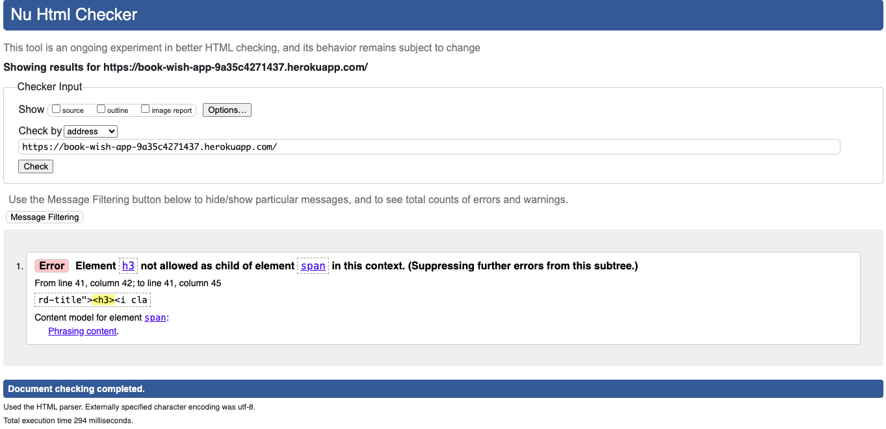
  - Final Validation: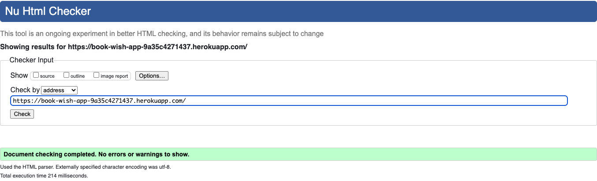

  An error appeared during the initial validation of the welcome page, which was promptly addressed to ensure compliance with HTML standards.

  
Sign Up Page:

   
  - Validation: 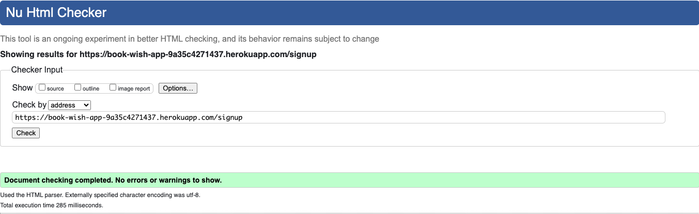

  
Log In Page:

   
  - Validation: 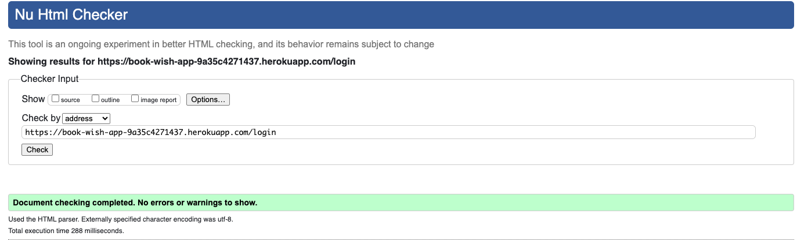

  
Wishlist Page:

   
  - Validation: 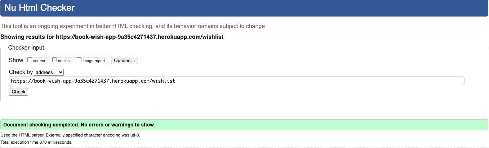

  
Add Book Page:

   
  - Validation: 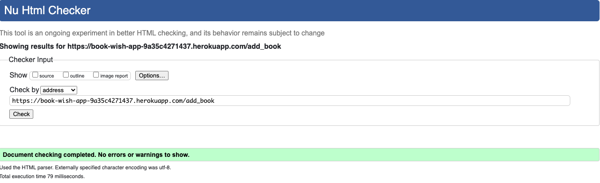

  
Edit Book Page:

   
  - Validation: 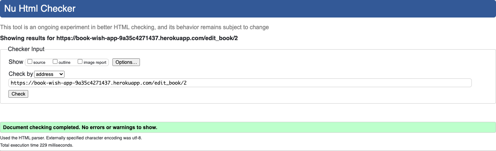

## CSS Validation

During CSS validation using the Jigsaw validator, I encountered persistent errors across all pages. The validation process flagged errors that appear to originate from the Materialize CSS framework, rather than from the custom code I have written.

  
Error Details

   
  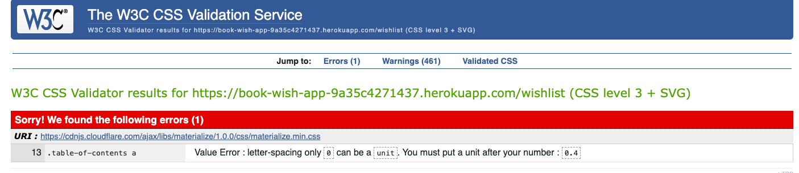

### Challenges Encountered:

1. **Identification of Error Causes**: Upon investigation, I discovered that the errors were triggered by specific CSS properties or rules within the Materialize CSS framework.

2. **Application of Overrides**: I attempted to address these errors by applying overrides in my custom CSS file. However, despite my efforts, the errors persisted.

### Resolution Status:

Given that the errors seem to stem from the Materialize CSS framework rather than from my own code, I have chosen to leave them unresolved for now. This decision is based on the following considerations:

- **Complexity of Overrides**: Attempting to override Materialize CSS rules may lead to unintended consequences or conflicts with other components.
- **Minimal Impact**: While CSS compliance is important, the flagged errors do not appear to have a significant impact on the functionality or user experience of my website.

### Next Steps:

Although I have opted to leave the errors unresolved at this time, I remain committed to maintaining high standards of CSS compliance and optimization. In the future, I may revisit these errors and explore alternative approaches to address them effectively.

By documenting these challenges and decisions, I ensure transparency and accountability in my development process, fostering continuous improvement and refinement of my website's CSS code.

## JavaScript validation
To validate javascript jshint was used. 
- [script.js](documentation/testing/js-val/js-val.png)

## Python validation

### Debug Mode Set to False

During development, the Flask application's `DEBUG` mode was set to `False` to simulate the production environment accurately. This configuration helped in detecting potential errors and misconfigurations that might occur when the application is deployed in a production environment.

### Route Testing

Each route in the application was thoroughly tested during development to ensure that it behaves as intended. Here's how the testing process was conducted for each route:

1. **Home Route (`/`)**:
   - Verify that the home route renders the `welcome.html` template correctly.
   - Ensure that the route redirects to the login page if the user is not authenticated.

2. **Signup Route (`/signup`)**:
   - Test user registration by submitting valid and invalid signup forms.
   - Verify that the route handles duplicate usernames gracefully.
   - Confirm that the user is redirected to the login page after successful registration.

3. **Login Route (`/login`)**:
   - Test user login with valid and invalid credentials.
   - Ensure that the user session is created upon successful login.
   - Verify that appropriate error messages are displayed for invalid login attempts.

4. **Logout Route (`/logout`)**:
   - Test user logout functionality by checking if the session is cleared upon logout.
   - Confirm that the user is redirected to the home page after logout.

5. **Wishlist Route (`/wishlist`)**:
   - Validate that the wishlist route displays the user's wishlist if the user is authenticated.
   - Test redirection to the login page if the user is not authenticated.

6. **Add Book Route (`/add_book`)**:
   - Test adding a new book to the wishlist by submitting the add book form with valid data.
   - Verify that the route redirects to the login page if the user is not authenticated.

7. **Edit Book Route (`/edit_book/<int:book_id>`)**:
   - Test updating book details by submitting the edit book form with valid data.
   - Ensure that the route handles invalid book IDs gracefully.

8. **Delete Book Route (`/delete_book/<int:book_id>`)**:
   - Test deleting a book from the wishlist by submitting the delete book form.
   - Ensure that the route handles invalid book IDs gracefully.

### PEP8 Style Considerations

Throughout development, I've strived to adhere to PEP8 guidelines for coding style. While I've thoroughly reviewed the guidelines and made efforts to apply them consistently, achieving perfect compliance can be challenging.

Here's how I approached PEP8 compliance:

- I familiarized myself with the PEP8 documentation.
- I applied PEP8 guidelines, focusing on naming conventions, indentation, and spacing.
- Despite challenges, I prioritized readability and maintainability to optimize the codebase for reliability.

## Lighthouse

Lighthouse google develop tools was uses to test.

#### Welcome Page

Screenshot

 
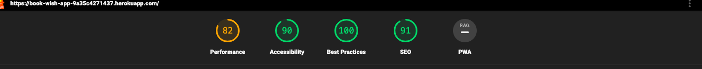

#### Sign Up Page

Screenshot

 
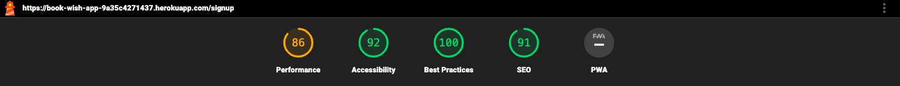

#### Log In Page

Screenshot

 
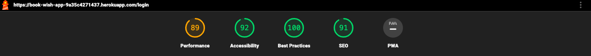

#### Wishlist Page

Screenshot

 

#### Add Book Page

Screenshot

 
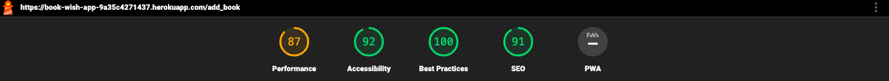

#### Edit Book Page

Screenshot

 
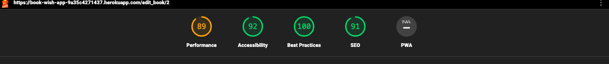

## Testing user stories

1. As a user, I want to understand the purpose of the site and navigate it easily.

| **Feature** | **Action** | **Expected Result** | **Actual Result** |
|-------------|------------|---------------------|-------------------|
| Welcome Card on the Welcome Page | View the Welcome Page | Upon landing on the Welcome Page, a prominent Welcome Card is displayed, containing clear and concise content explaining the purpose of the website. | Upon accessing the Welcome Page, a visually appealing Welcome Card is presented, featuring an inviting message outlining the website's purpose. The card includes noticeable links for sign-up and login, facilitating easy access to account creation and login functionalities. |
| Navigation Links on the Welcome Page|View the Navigation Links | Beneath the Welcome Card, visible and intuitive navigation links, such as "Sign Up" and "Log In", are displayed, enabling seamless navigation to account creation and login processes.| Below the Welcome Card, easily accessible navigation links are present, allowing swift movement to the sign-up and login sections. The links are clearly labeled, aiding users in understanding the next steps to access the website's features. |

Screenshots

 
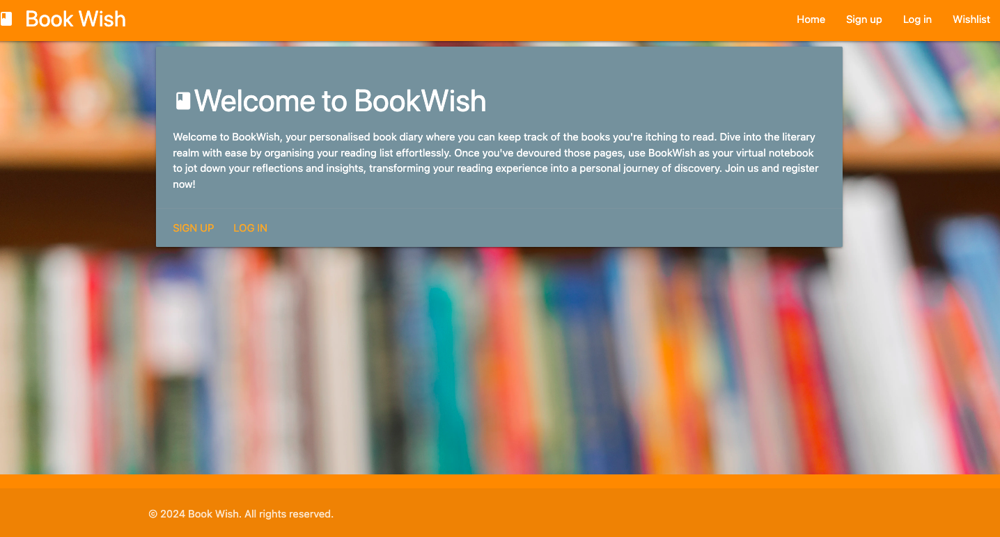

2. As a user, I want to register for an account.

| **Feature** | **Action** | **Expected Result** | **Actual Result** |
|-------------|------------|---------------------|-------------------|
| Sign-Up Form on Sign-Up Page | View and Fill in Sign-Up Form | When accessing the Sign-Up Page, a clear and accessible Sign-Up Form is displayed, prompting the user to input necessary details such as username and password.| Upon accessing the Sign-Up Page, a well-structured Sign-Up Form is presented, allowing users to input their desired username and password in designated fields. The form is user-friendly and provides clear instructions on required fields.|
| Account Creation | Submit Sign-Up Form | After filling in the required information and submitting the Sign-Up Form, the user's account is successfully created, and they are redirected to the login page to access their newly registered account.| Once the user submits the Sign-Up Form, their account is successfully created, and they are automatically redirected to the login page. A confirmation message is displayed, informing the user that their account has been successfully registered.|

Screenshots

 
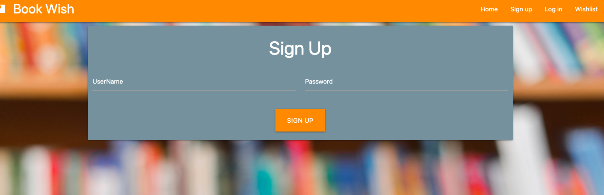

3. As a user, I want to log into my account.

| **Feature** | **Action** | **Expected Result** | **Actual Result** |
|-------------|------------|---------------------|-------------------|
| Login form on login page | View and Fill in Login Form | Upon accessing the Login Page, a clear and accessible Login Form is displayed, prompting the user to input necessary details such as username and password.| Upon accessing the Login Page, a Login Form is presented, allowing users to input their username and password in designated fields.|
| Redirect to Wishlist Page | Submit Login Form | After filling in the required login credentials and submitting the form, the user is redirected to their Wishlist Page, where they can view their personalized book wishlist. |After submitting the Login Form with valid credentials, the user is successfully redirected to their Wishlist Page, confirming the login.|
| Successful Login Notification | View Notification Message | Upon successful login and redirection to the Wishlist Page, a notification message is displayed, confirming that the user has logged in successfully. | After being redirected to the Wishlist Page, a notification message appears, indicating a successful login.|

Screenshots

 
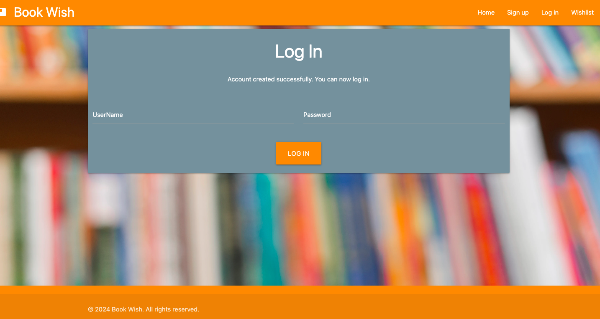

4. As a user, I want to easily add books to my wishlist.

| **Feature** | **Action** | **Expected Result** | **Actual Result** |
|-------------|------------|---------------------|-------------------|
| Add book button | Press the button | Upon pressing the "Add Book" button, the user should be redirected to the Add Book Form page. | When the user presses the "Add Book" button, they are directed to the Add Book Form page.|
| Add book form | Fill in the Form | After filling in all required fields in the Add Book Form and pressing the "Add Book" button, the book should be added to the user's wishlist. | After completing all required fields in the Add Book Form and clicking the "Add Book" button, the book is successfully added to the user's wishlist. |

Screenshots

 
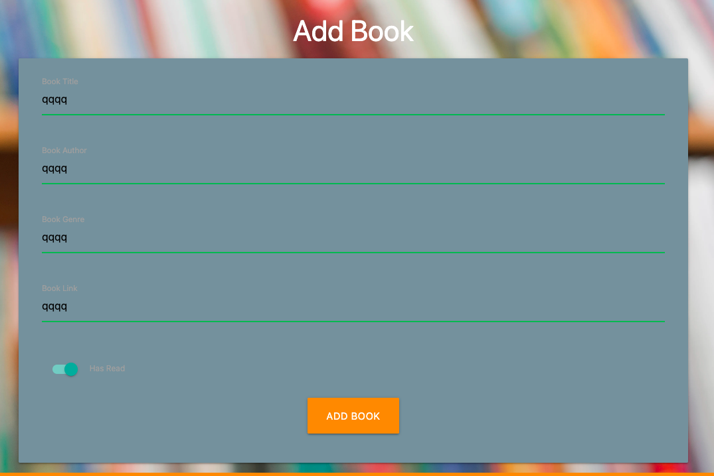

5. As a user, I want to be able to edit the details of books I have added to my wishlist.

| **Feature** | **Action** | **Expected Result** | **Actual Result** |
|-------------|------------|---------------------|-------------------|
| Edit Button on Book | Press the button | Upon pressing the "Edit Book" button on a book card in the wishlist, the user should be redirected to the Edit Book Form page.| When the user presses the "Edit Book" button, they are directed to the Edit Book Form page.|
| Edit Book Form | Fill in the Form | After filling in all required fields in the Edit Book Form and pressing the "Edit Book" button, the book details should be updated in the user's wishlist. | After completing all required fields in the Edit Book Form and clicking the "Edit Book" button, the book is successfully edited in the user's wishlist. |

Screenshots

 
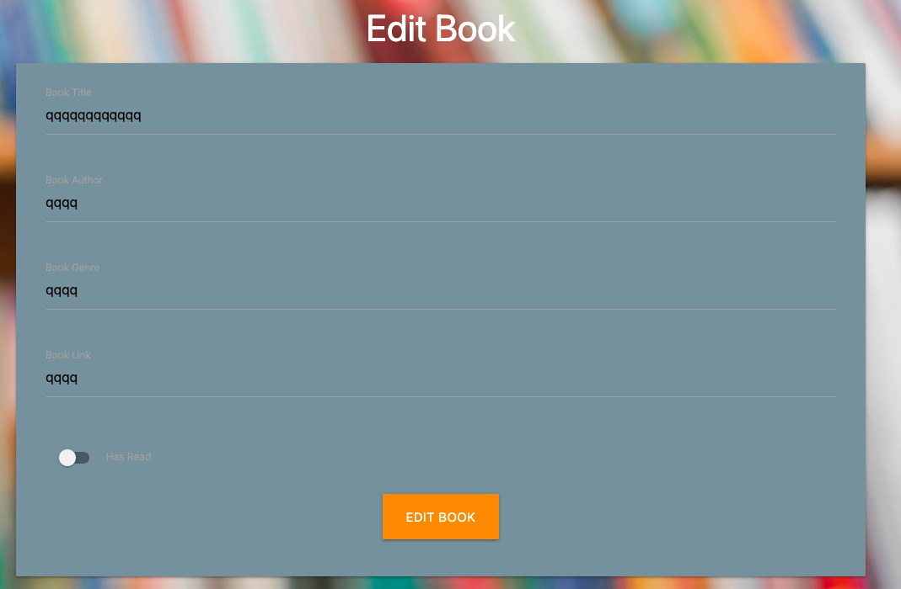

6. As a user, I want to have the option to remove books from my wishlist.

| **Feature** | **Action** | **Expected Result** | **Actual Result** |
|-------------|------------|---------------------|-------------------|
| Delete Button | Press the button| Upon pressing the "Delete" button on a book card in the wishlist, a modal should appear asking for confirmation to delete the book. If confirmed, the book should be removed from the wishlist.| When the user presses the "Delete" button, a modal should appear asking for confirmation. If confirmed, the book is removed from the wishlist.|

Screenshots

 
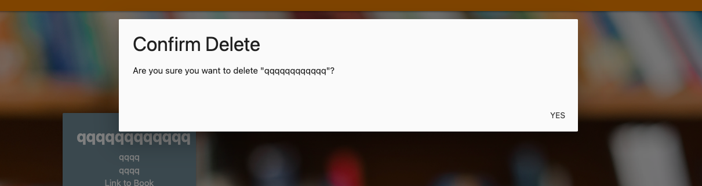

7. As a user, I want assurance that my wishlist remains private and accessible only to me.

| **Feature** | **Action** | **Expected Result** | **Actual Result** |
|-------------|------------|---------------------|-------------------|
| Wishlist Access | Click on Wishlist| When a user who is not logged in clicks on the Wishlist link in the navigation bar, they should be redirected to the login page and shown a message indicating that they need to log in to view their wishlist. | When a non-logged-in user clicks on the Wishlist link, they are redirected to the login page with a message stating they need to log in to view their wishlist.|

Screenshots

 
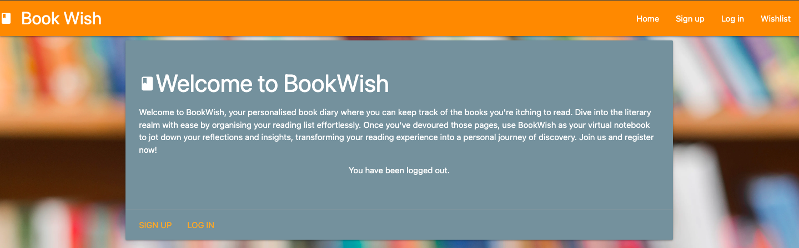

8. As a user, I want a straightforward and quick method to log out of my account, ensuring my privacy and security.

| **Feature** | **Action** | **Expected Result** | **Actual Result** |
|-------------|------------|---------------------|-------------------|
| Logout Button | Click the Button | When a logged-in user clicks on the logout button in the navigation bar, they should be logged out of their account and redirected to the Welcome Page. Additionally, a message confirming successful logout should be displayed. | Upon clicking the logout button in the navbar, the user is logged out of their account and redirected to the Welcome Page. A message confirming successful logout is displayed. |

Screenshots

 

## Bugs
### Solved Bugs
|**Num** | **Bug** | **Fix** |
| ----------- | ----------- | ---------- |
| 1 | While implementing the wishlist route, I encountered a bug where the wishlist page always displayed an empty list of books, despite adding books to the database. This occurred because I mistakenly placed the return statement above the database query to fetch the list of books. As a result, the query to retrieve the books was never executed, causing the wishlist page to render without any book data.| To resolve this issue, I moved the return statement below the database query, ensuring that the query to fetch the list of books is executed before rendering the wishlist page. This correction allowed the wishlist page to display the correct list of books, restoring the functionality of the wishlist feature. By addressing this bug, I ensured that users can properly view and manage their wishlist, enhancing the overall usability and effectiveness of the application.|
| 2 | After implementing user signup functionality, I encountered an error when submitting the signup form. The error message indicated that the password exceeded the maximum allowed length. This issue arose because the hashed password exceeded the length limit specified in the user model, resulting in validation failure during form submission.| To address this issue, I adjusted the maximum length constraint for passwords in the user model to accommodate longer hashed passwords. By increasing the length limit, I ensured compatibility with the hashed password format while maintaining security standards. After making this modification, the signup form successfully processed passwords of any length within the new constraint, resolving the validation error.|
| 3 | [Edit Book Route Bug](documentation/testing/bugs/edit_book.png) I encountered a bug while creating the edit_book route, where the book_id was undefined, leading to errors during execution. This issue happened because I forgot to pass the book_id parameter in the return render_template function, despite passing the book object. As a result, attempting to run the route triggered an error message. | To address this issue, I ensured the inclusion of the book_id parameter in the template rendering process. This resolved the error, enabling seamless functionality of the edit_book route for manipulating book details. |
| 4 | When attempting to edit a book, I noticed that the content areas were initially blank instead of displaying the existing book details. This required users to rewrite everything, which was inefficient and prone to errors.| To resolve this, I updated the edit_book.html template to include the 'value' attribute for each input field. For example, I added value="{{ book.book_title }}" to ensure that the current book title is displayed in the input field when editing. By prefilling the input fields with existing book details, users can easily make modifications without having to re-enter all the information, thus improving the editing experience and reducing the likelihood of errors.|
| 5 | [Background Bug](documentation/testing/bugs/bgbug.png) I encountered a bug where the background wasn't covering the whole background as a whole, it was split at each end of the form. This occurred because the CSS classes I initially used didn't produce the desired effect.| To fix this, I modified the CSS by including it directly in the body of the HTML document. This adjustment ensured that the background covered the entire background resolving the split background problem. By integrating the CSS directly into the body, I ensured consistent application of the background styling, therefor improving the overall visual coherence of the website.|
| 6 | [Card Size Bug](documentation/testing/bugs/cardsize.png) I encountered a bug where adding books for testing revealed that cards with more content appeared longer than others, resulting in inconsistent card sizes. This occurred due to the absence of styling to ensure uniform card dimensions. | To address this issue, I implemented wishlist card styling to ensure all cards on the wishlist page are of uniform size. This allows users to scroll through cards with extensive content while maintaining visual consistency. By applying this styling, I ensured the consistency of card sizes, improving both the aesthetics and accessibility of the page. |
| 7 | [Double Message Bug](documentation/testing/bugs/double_messages.png)  I encountered a bug where submitting forms resulted in flash messages appearing twice on the page. This occurred because I mistakenly placed a flash message in my base.html instead of my welcome.html. The intended behavior was for the message to appear only when a user logs out of their account and is redirected to the welcome page. | To resolve this issue, I removed the flash message from my base.html and relocated it to my welcome.html. This ensures that the message is displayed correctly only on the welcome page after a user logs out, eliminating the duplication of flash messages. |

### Known Bugs

#### Delete Book Modal Display Issue

Currently, the delete book modal only shows the "Yes" button and not the "No" link. The HTML for the modal does have a "No" option, but for some reason, it doesn't appear. However, the main purpose of the modal is to delete the book, and the "Yes" button completes this function perfectly. Users can also dismiss the modal by clicking anywhere on the page if they choose not to delete the book.

While the absence of the "No" link does not hinder the primary function of the modal, it may lead to some user confusion or uncertainty about the available options within the modal interface. II will continue investigating this issue to resolve it.
